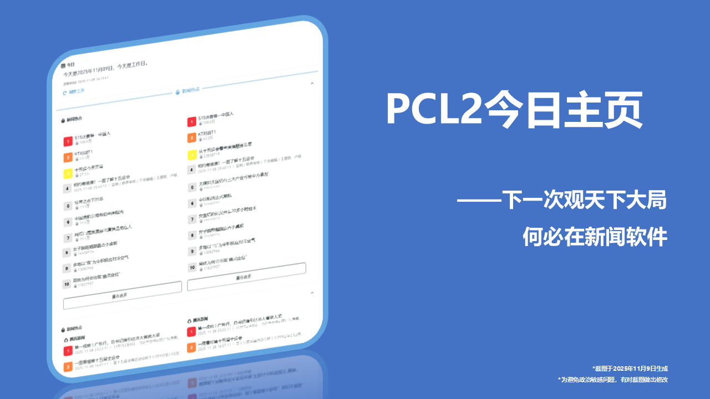
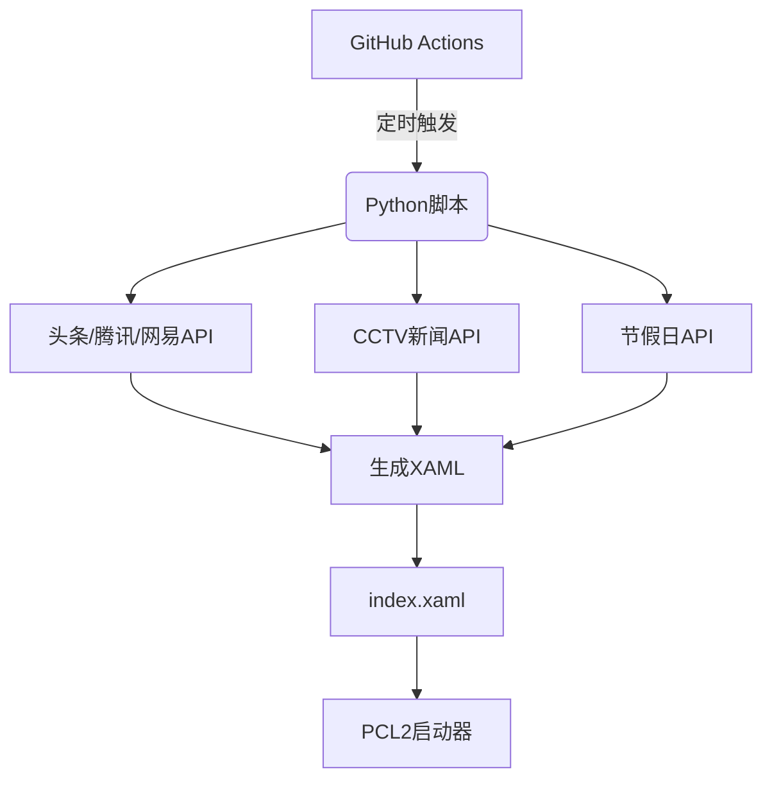

# PCL2-TodayHomepage

- [PCL2-TodayHomepage](#pcl2-todayhomepage)
  - [核心功能](#核心功能)
  - [使用说明](#使用说明)
  - [内容模块](#内容模块)
  - [技术架构](#技术架构)
  - [版权声明](#版权声明)
    - [内容部分](#内容部分)
    - [代码部分](#代码部分)

## 核心功能

1. **动态内容聚合** 
   - 实时整合新浪微博、头条、腾讯、网易四大新闻平台的热点
   - 自动抓取哔哩哔哩热门视频
   - 之后会添加哔哩哔哩、抖音热门视频~~也有可能没有~~

2. **安全访问控制** 🔒
   - Cloudflare Worker实现代理访问
   - 严格的用户代理(UA)验证
   - 智能频率限制保护资源

3. **自动化系统** 🔄
   - 每30分钟自动更新内容
   - 自动提交更新到仓库
   - 版本追踪与记录

## 使用说明

在PCL2启动器中：
1. 打开"设置" → "个性化"
2. 在"联网更新"中输入 ``https://pcl.wyc-w.top/index.xaml``

## 内容模块

1. **今日概览** 🗓
   - 当前日期和节假日状态

2. **新闻热点** 🔥
   - 三大平台热点新闻聚合
   - 带热度值和图片展示
   - 分类查看选项

3. **央视新闻** 📺
   - 国内要闻精选
   - 国际时事速递

## 技术架构

## 版权声明

### 内容部分

   - 范围：``.xaml``文件、本文、``images``文件夹中的图像
   - 采用 **[CC BY-NC-SA 4.0](https://creativecommons.org/licenses/by-nc-sa/4.0/)** 许可
   - **包含的第三方新闻数据版权归原始媒体所有**

### 代码部分
   - 范围：除由程序生成的.xaml文件
   - 采用 **[GPL-3.0 license](https://www.gnu.org/licenses/gpl-3.0.html)** 许可
  
> [!IMPORTANT]
> **重要声明**：本系统生成的新闻内容来自第三方 API，新闻内容版权属于原始媒体机构。本仓库仅提供技术整合，不对第三方内容的版权负责，用户需自行确保合规使用。
